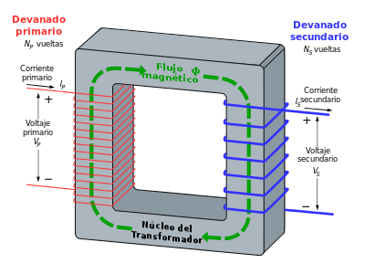
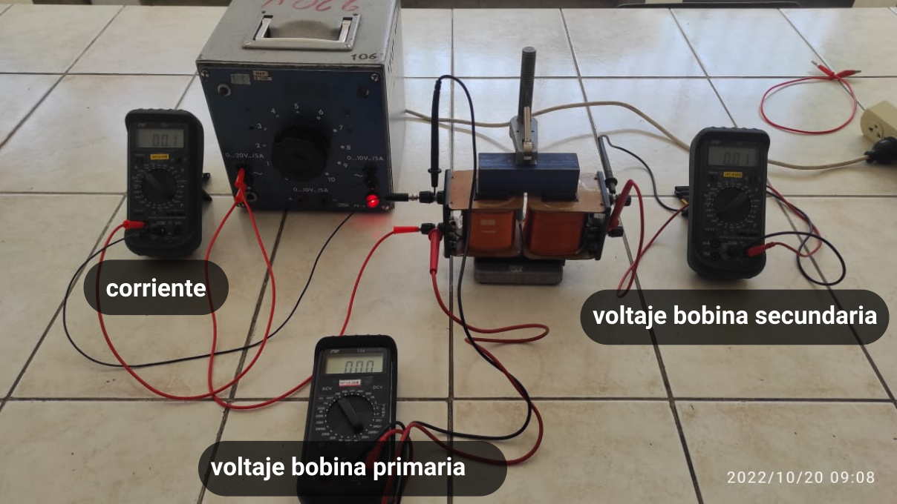
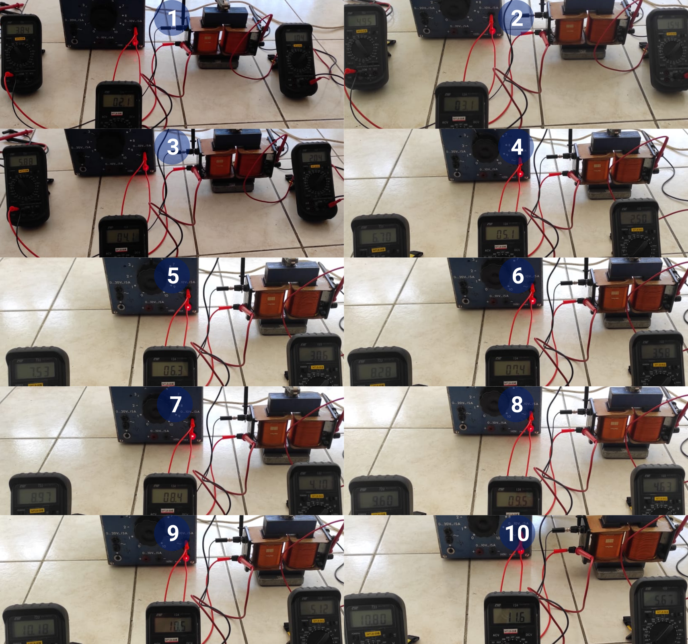
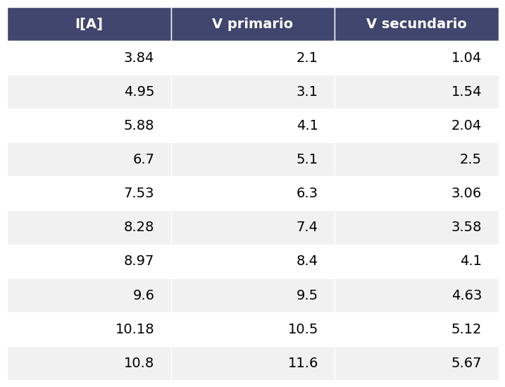
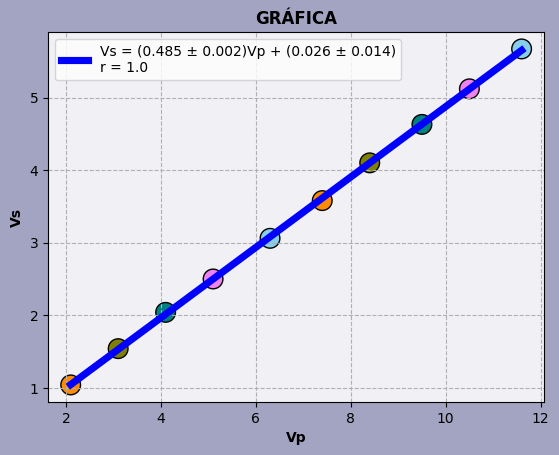
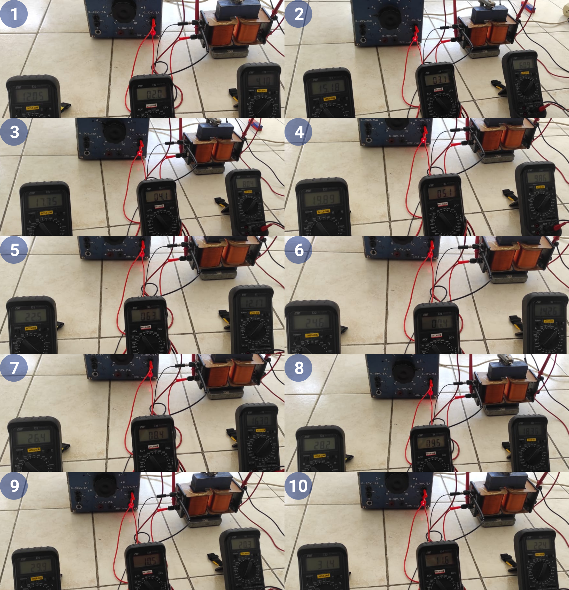
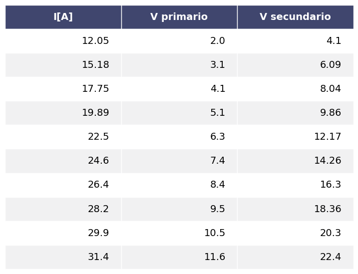
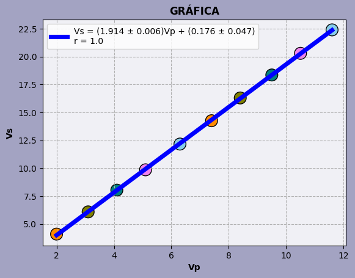

# LABORATORIO 11: LEY DE FARADAY

Establecer que la tensión incluida en un círcuito cerrado es directamente proporcional a la rapidez con que cambia en el tiempo el flujo magnético que atraviesa una superficie cualquiera con el circuito como borde.

**Como el primario obedece**

$$V_P = N_P \frac{d \phi_B}{dt}$$

**Para el secundario**

$$V_S = -N_S \frac{d \phi_B}{dt}$$

**Dividiendo las dos ecuaciones anteriores**

$$\frac{V_P}{V_S} = \frac{N_P}{N_S}$$

**TRANSFORMADOR**



**Materiales**
* Fuente de corriente alterna.
* Multímetro digital.

**Montaje**



**Importando librerias necesarias.**


```python
from __future__ import annotations

import numpy as np
# import matplotlib.pyplot as plt
from matplotlib import pyplot
import six
import math
```

**Creando clase para resolver por el método de los mínimos cuadrados.**


```python
from enum import Enum, unique


@unique
class Operation(Enum):
    ADD = 0
    SUB = 1
    MUL = 2
    TRUEDIV = 3
    FLOORDIV = 4
    POW = 5
    MOD = 6


class LException(Exception):

    def __init__(self, *args):
        super(LException, self).__init__(*args)


class List(list):
    """
    @author: Edgar Alejo Ramirez
    """

    def __init__(self):
        super().__init__()

    def __add__(self, other: int | float | List):
        return self.__fun(other, Operation.ADD)

    def __sub__(self, other: int | float | List):
        return self.__fun(other, Operation.SUB)

    def __mul__(self, other: int | float | List):
        return self.__fun(other, Operation.MUL)

    def __truediv__(self, other: int | float | List):
        return self.__fun(other, Operation.TRUEDIV)

    def __floordiv__(self, other: int | float | List):
        return self.__fun(other, Operation.FLOORDIV)

    def __pow__(self, power: int | List, modulo = None):
        return self.__fun(power, Operation.POW)

    def __mod__(self, other: int | float | List):
        return self.__fun(other, Operation.MOD)

    def __op(self, other: int | float | List, operation: Operation, array: bool = False) -> List:
        values = List()
        for i in range(len(self)):
            if operation == Operation.ADD:
                values.append(self[i] + other[i] if array else self[i] + other)
            elif operation == Operation.SUB:
                values.append(self[i] - other[i] if array else self[i] - other)
            elif operation == Operation.MUL:
                values.append(self[i] * other[i] if array else self[i] * other)
            elif operation == Operation.TRUEDIV:
                values.append(self[i] / other[i] if array else self[i] / other)
            elif operation == Operation.FLOORDIV:
                values.append(self[i] // other[i] if array else self[i] // other)
            elif operation == Operation.POW:
                values.append(self[i] ** other[i] if array else self[i] ** other)
            elif operation == Operation.MOD:
                values.append(self[i] % other[i] if array else self[i] % other)
            else:
                raise LException(f"invalid operation")
        return values

    def __fun(self, other: int | float | List, op: Operation):
        if isinstance(other, (int, float)):
            return self.__op(other, op)
        elif isinstance(other, List):
            if len(self) == len(other):
                return self.__op(other, op, array = True)
            else:
                raise LException(f"lists must be of equal size")
        else:
            raise LException(f"only types are supported: {int}, {float} and {List}")
```


```python
from csv import writer, reader


class LRException(Exception):
    def __init__(self, *args):
        super(LRException, self).__init__(*args)


class LeastSquares:
    """
    @author: Edgar Alejo Ramirez
    """

    def __init__(self, data: dict | str):
        self.__array: dict
        self.__path: str

        if isinstance(data, dict):
            self.__array = data
        elif isinstance(data, str):
            self.__path = data
            self.__array = {key: value for key, value in self.__readcsv()}
        else:
            raise LRException(f'Required data types: {dict} or path of *.csv file {str}')

        self.__n = len(self)

        self.__promx = None
        self.__promy = None

        self.__sumx = None
        self.__sumy = None
        self.__sumx2 = None
        self.__sumy2 = None
        self.__sumxy = None

        self.__columnx = None
        self.__columny = None

        self.__x = None
        self.__y = None

    def __len__(self):
        return self.dimension()[1]

    def __getitem__(self, index):
        try:
            return self.__array[index]
        except KeyError as e:
            raise LRException(f"column {e} does not exist")

    def __setitem__(self, index, value):
        self.__array[index] = value

    def __defx(self):
        self.__promx = np.mean(self[self.__columnx])
        self.__sumx = np.sum(self[self.__columnx])
        self.__sumx2 = np.sum(self[self.__columnx] ** 2)

    def __defy(self):
        self.__promy = np.mean(self[self.__columny])
        self.__sumy = np.sum(self[self.__columny])
        self.__sumy2 = np.sum(self[self.__columny] ** 2)

    def __defxy(self):
        self.__sumxy = np.sum(self[self.__columnx] * self[self.__columny])

    def __validate(self):
        if self.__columnx is None or self.__columny is None:
            raise LRException(f"you must specify columns x and y")

    def __readcsv(self):
        with open(self.__path, newline = '') as file:
            values = List()
            for r in reader(file):
                values.append(r)
            values = self.__invert(values)
            for val in values:
                lt = List()
                for v in val[1:]:
                    lt.append(float(v))
                yield str(val[0]), lt

    def __writecsv(self):
        with open(self.__path, mode = 'w') as File:
            write = writer(File)
            write.writerow(self.__array)

    @staticmethod
    def __invert(array: List) -> List:
        val = List()
        for i in range(len(array[0])):
            aux = List()
            for j in range(len(array)):
                aux.append(array[j][i])
            val.append(aux)
        return val

    @staticmethod
    def __round(decimals: int, formula: float) -> float:
        if decimals is None:
            return formula
        if not isinstance(decimals, int):
            raise LRException(f"only {int} type values are supported")
        if decimals < 0:
            raise LRException(f"only positive values including zero are allowed")
        return round(formula, decimals)

    def a(self, decimals: int = None) -> float:
        """
        Pendiente de la recta. fórmula
        :return:
        """
        self.__validate()
        tmp = (self.__n * self.__sumxy - self.__sumx * self.__sumy) / (self.__n * self.__sumx2 - self.__sumx ** 2)
        return self.__round(decimals = decimals, formula = tmp)

    def b(self, decimals: int = None) -> float:
        """
        Término independiente de la recta.
        :return:
        """
        self.__validate()
        tmp = (self.__sumy * self.__sumx2 - self.__sumx * self.__sumxy) / (self.__n * self.__sumx2 - self.__sumx ** 2)
        return self.__round(decimals = decimals, formula = tmp)

    def r(self, decimals: int = None) -> float:
        """
        Coeficiente de correlación.
        :return:
        """
        self.__validate()
        tmp = np.sum(
            (self[self.__columnx] - self.__promx) * (self[self.__columny] - self.__promy)
        ) / (math.sqrt(
            np.sum((self[self.__columnx] - self.__promx) ** 2)
        ) * math.sqrt(
            np.sum((self[self.__columny] - self.__promy) ** 2)
        ))
        return self.__round(decimals = decimals, formula = tmp)

    def sigmay(self, decimals: int = None) -> float:
        """
        Incertidumbre de datos.
        :return:
        """
        self.__validate()
        tmp = math.sqrt(
            np.sum(
                (self[self.__columny] - (self[self.__columnx] * self.a()) - self.b()) ** 2
            ) / (self.__n - 2)
        )
        return self.__round(decimals = decimals, formula = tmp)

    def erra(self, decimals: int = None) -> float:
        """
        Incertidumbre de la pendiente.
        :return:
        """
        self.__validate()
        tmp = self.sigmay() * math.sqrt(self.__n / (self.__n * self.__sumx2 - self.__sumx ** 2))
        return self.__round(decimals = decimals, formula = tmp)

    def errb(self, decimals: int = None) -> float:
        """
        Incertidumbre del término independiente.
        :return:
        """
        self.__validate()
        tmp = self.sigmay() * math.sqrt(self.__sumx2 / (self.__n * self.__sumx2 - self.__sumx ** 2))
        return self.__round(decimals = decimals, formula = tmp)

    def equation(self, decimals: int = None, uncertainty: bool = False) -> str:
        """
        Ecuación de la recta.
        :return:
        """
        b = self.b(decimals)
        sign = "+" if b > 0 else "-"
        if not isinstance(uncertainty, bool):
            raise LRException(f"{uncertainty} not of type {bool}")
        if uncertainty:
            return f"{self.__y} = ({self.a(decimals)} ± {self.erra(decimals)}){self.__x} {sign} ({abs(b)} ± {self.errb(decimals)})"
        return f"{self.__y} = {self.a(decimals)}{self.__x} {sign} {abs(b)}"

    def table(
        self,
        decimals: int = 3,
        colwidth: int | float = 3.0,
        rowheight: int | float = 0.625,
        fontsize: int | float = 14,
        headercolor: str = '#40466e',
        rowcolors: list[str] = None,
        edgecolor: str = 'w',
        bbox: list[int] = None,
        headercolumns: int = 0,
        ax = None,
        **kwargs
    ) -> None:
        if bbox is None:
            bbox = [0, 0, 1, 1]
        if rowcolors is None:
            rowcolors = ['#f1f1f2', 'w']
            # rowcolors = ['#c2c2d6', 'w']
        if ax is None:
            size = (np.array(self.dimension()) + np.array([0, 1])) * np.array([colwidth, rowheight])
            fig, ax = pyplot.subplots(figsize = size)
            ax.axis('off')
        values = [i for i in self.__array.values()]
        values = np.round(values, decimals = decimals)
        values = self.__invert(values)
        mtable = ax.table(cellText = values, bbox = bbox, colLabels = self.headers(), **kwargs)
        mtable.auto_set_font_size(False)
        mtable.set_fontsize(fontsize)

        for k, cell in six.iteritems(mtable.get_celld()):
            cell.set_edgecolor(edgecolor)
            if k[0] == 0 or k[1] < headercolumns:
                cell.set_text_props(weight = 'bold', color = 'w')
                cell.set_facecolor(headercolor)
            else:
                cell.set_facecolor(rowcolors[k[0] % len(rowcolors)])
        pyplot.show()

    def graph(
        self, title = "GRAPH", linewidth = 3,
        pointsize = 200, savepng: bool = False,
        xlabel: str = None, ylabel: str = None,
        decimals: int = None,
        uncertainty: bool = False
    ) -> None:
        self.__validate()
        diff_linewidth = 1.05
        color = ['darkorange', 'olive', 'teal', 'violet', 'skyblue', 'darkorange', 'olive', 'teal', 'violet', 'skyblue']
        pyplot.figure(facecolor = '#a3a3c2')
        pyplot.scatter(
            self[self.__columnx], self[self.__columny],
            edgecolors = "black", c = color, s = pointsize, marker = "o"
        )

        pyplot.plot(
            self[self.__columnx],
            self.a() * self[self.__columnx] + self.b(),
            c = "blue", linewidth = 2 + (diff_linewidth * linewidth),
            label = self.equation(decimals, uncertainty) + "\nr = " + str(self.r(decimals))
        )
        pyplot.xlabel(self.__x if xlabel is None else xlabel, fontweight = "bold")
        pyplot.ylabel(self.__y if ylabel is None else ylabel, fontweight = "bold")
        pyplot.title(title, fontweight = "bold")
        if savepng:
            pyplot.savefig('graph.png', dpi = 800)
        gca = pyplot.gca()
        gca.set_facecolor('#f0f0f5')
        pyplot.grid(True, linestyle = '--')
        pyplot.legend()

    def dimension(self) -> tuple:
        row = 0
        for v in self.__array.values():
            row = len(v)
        return len(self.__array), row

    def headers(self) -> list:
        return [k for k in self.__array.keys()]

    @property
    def x(self):
        return self.__columnx

    @x.setter
    def x(self, value: tuple):
        if isinstance(value, tuple):
            self.__columnx = value[0]
            self.__x = value[1]
            self.__defx()
            if self.__columny is not None:
                self.__defxy()
        else:
            raise LRException(f"allowed values of type {str}")

    @property
    def y(self):
        return self.__columny

    @y.setter
    def y(self, value: tuple):
        if isinstance(value, tuple):
            self.__columny = value[0]
            self.__y = value[1]
            self.__defy()
            if self.__columnx is not None:
                self.__defxy()
        else:
            raise LRException(f"allowed values of type {str}")
```

**Actividad I**

* Bobina primaria 1200 vueltas.
* Bobina secundaria 600 vueltas.

Datos obtenidos.



Creando un objeto de tipo LeastSquares


```python
lsmaxmin = LeastSquares('../models/maxmin.csv')
```

Mostrando la tabla obtenida en el laboratio.


```python
lsmaxmin.table()
```


    

    


Definiendo la variable dependiente e independiente.


```python
lsmaxmin.x = ('V primario', 'Vp')
lsmaxmin.y = ('V secundario', 'Vs')
```

Ecuación lineal.


```python
print(lsmaxmin.equation(decimals = 4, uncertainty = True))
```

    Vs = (0.4848 ± 0.0019)Vp + (0.0263 ± 0.0145)


Incertidumbre.


```python
lsmaxmin.r()
```


    0.9999361350422482


Graficando


```python
lsmaxmin.graph(title = "GRÁFICA", pointsize = 200, linewidth = 3, decimals = 3, uncertainty = True, savepng = False)
```


    

    


**Actividad II**

* Bobina primaria 600 vueltas.
* Bobina secundaria 1200 vueltas.

Datos obtenidos



Creando un objeto de tipo LeastSquares


```python
lsminmax = LeastSquares('../models/minmax.csv')
```

Mostrando la tabla obtenida en el laboratio.


```python
lsminmax.table()
```


    

    


Definiendo la variable dependiente e independiente.


```python
lsminmax.x = ('V primario', 'Vp')
lsminmax.y = ('V secundario', 'Vs')
```

Ecuación lineal.


```python
print(lsminmax.equation(decimals = 4, uncertainty = True))
```

    Vs = (1.9136 ± 0.0063)Vp + (0.1755 ± 0.0467)


Incertidumbre.


```python
lsminmax.r(3)
```


    1.0


Graficando.


```python
lsminmax.graph(title = "GRÁFICA", pointsize = 200, linewidth = 3, decimals = 3, uncertainty = True, savepng = False)
```


    

    


```python

```


